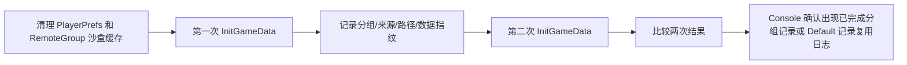

# Remote Group 测试窗口使用说明

菜单：

```text
Tools -> Remote System -> Remote Group Test
```

## 一次完整测试顺序

1. 在 `Remote Group Config` 中确认配置并重新导出运行时配置、分组策略和商业化文件。
2. 在测试窗口点击 `重新读取 Remote Group Config`。
3. 点击 `全量远端预检（四种开关组合）`，确认公共、国家分组、国家关卡、两者同时开启四种 URL 均返回成功。
4. 点击 `检查本地 Default 回退条件`，确认 `Assets/StreamingAssets/RemoteGroup/Default.bytes` 存在且非空。
5. 点击 `当前配置：首请求 + 正式记录复用`，验证首次请求和第二次启动结果一致。
6. 点击 `当前策略随机覆盖测试`，统计权重分组是否都能被随机到；分组较多时提高随机覆盖次数。
7. 需要检查日志时，在 Console 搜索 `LogGameConfigLoad`。

## 自动化按钮的含义

| 按钮 | 实际行为 | 是否修改运行时配置 |
|---|---|---|
| `全量远端预检（四种开关组合）` | 直接检查四种开关组合对应的策略 URL、非 `Default` 关卡 URL，并解析策略内容；可选检查全部商业化文件 | 否 |
| `当前配置：首请求 + 正式记录复用` | 清理正式记录和沙盒缓存，初始化一次，再初始化一次，比较分组、来源、路径、字节数和数据指纹 | 否，但会清理测试缓存 |
| `当前策略随机覆盖测试` | 每次清理缓存后重新初始化，连续执行指定次数并统计分组结果 | 否，但会反复请求远端并覆盖测试缓存 |
| `检查本地 Default 回退条件` | 只读取本地 `Default.bytes`，检查是否存在且非空 | 否 |
| `检查当前远端资源` | 只检查当前 `CountryType` 对应的策略和关卡 URL | 否 |
| `删除本地测试关卡文件` | 删除 `RemoteUpload` 下选中的本地测试文件，用于验证本地文件缺失状态 | 只删除本地测试文件 |

## 四种远端路径预检

预检使用当前 `RemoteRootUrl`，只临时组合 URL，不改动 `Resources/RemoteGroupRuntimeConfig`：

```mermaid
flowchart TD
    A[全量远端预检] --> B[公共模式<br/>Group=false Level=false]
    A --> C[仅国家分组<br/>Group=true Level=false]
    A --> D[仅国家关卡<br/>Group=false Level=true]
    A --> E[国家分组+国家关卡<br/>Group=true Level=true]
    B --> F[检查 Common/group.bytes]
    C --> G[检查 Country/group.bytes]
    D --> H[检查公共 Common/group.bytes]
    E --> I[检查 Country/group.bytes]
    F --> J[检查每个非 Default Common/gamedata/{Group}.bytes]
    G --> J
    H --> K[检查 Country/gamedata/{Group}.bytes]
    I --> K
```

国家开关开启时，预检会选择一个具体国家检查国家路径；另外单独检查 `CountryType.None` 时本地 `Default` 是否可读。预检只能证明资源地址和内容可访问，不能替代完整游戏 Loading 流程。

## 首请求与缓存复用验证



正式记录位置：

```text
PlayerPrefs:
  RemoteGroup.AssignmentCompleted
  RemoteGroup.UserGroupName（实际 Key 以运行时配置为准）

沙盒：
  Application.persistentDataPath/RemoteGroup/group.bytes
  Application.persistentDataPath/RemoteGroup/gamedata/{GroupName}.bytes
```

`Default` 的正式记录复用读取：

```text
Assets/StreamingAssets/RemoteGroup/Default.bytes
```

## 随机覆盖测试

随机覆盖测试每轮都会清理正式分组记录和沙盒缓存，然后重新执行真实初始化，因此会重新请求策略并重新随机。结果会列出：

- 每个分组被抽到的次数；
- 未被抽到的分组；
- 初始化失败次数和错误信息。

未抽到某个分组不一定表示代码错误，可能是样本次数不足；可把次数提高到 50 或 100 再复测。`Editor User Group Override` 开启时，所有真实随机测试都会被阻止。

## 远端失败回退测试边界

当前测试窗口可以检查本地 `Default` 是否具备回退条件，也可以删除本地 `RemoteUpload` 测试文件观察本地文件缺失状态，但不能通过删除本地文件制造真实远端 HTTP 失败。

要验证真正的“远端请求失败 -> 本地 Default 回退”，需要让 `RemoteRootUrl` 指向一个确定不存在或不可访问的测试服务，再通过游戏实际加载流程运行；测试窗口本身不修改运行时配置，也不直接模拟 HTTP 失败。

## 商业化配置检查

开启商业化预检后，窗口会读取项目中的 `ChannelABConfig`，按其 `groupConfigName`、国家列表和 `StartGroupIndexAtOne` 生成 URL，检查：

```text
RemoteUpload/commercial/{Prefix}{Index}.bytes
RemoteUpload/{Country}/commercial/{Prefix}{Index}.bytes
```

检查内容包括 HTTP 返回、`CHAB` 文件头、版本号和分组序号。商业化文件由 `Remote Group Config` 导出；当前 `InitRemoteGroupDataTask` 不负责商业化文件的运行时加载，商业化预检只是发布资源完整性检查。

## 不能由此窗口验证的内容

- `InitRemoteGroupDataTask` 是否等待 `LoadUserDataTask` 完成：必须运行完整游戏 Loading 流程。
- 用户数据请求失败后的 Loading 任务处理：必须通过真实登录/用户数据失败场景验证。
- 远端失败时 HTTP 请求、重试次数和最终回退日志：必须使用不可访问的测试根地址运行游戏。
- 商业化文件是否被业务模块消费：当前窗口只检查导出文件，当前远端分组初始化任务不读取它们。
